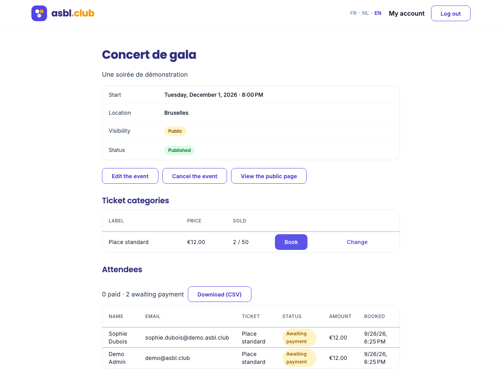
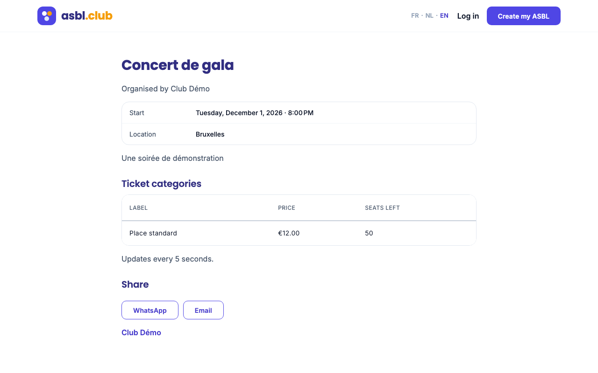
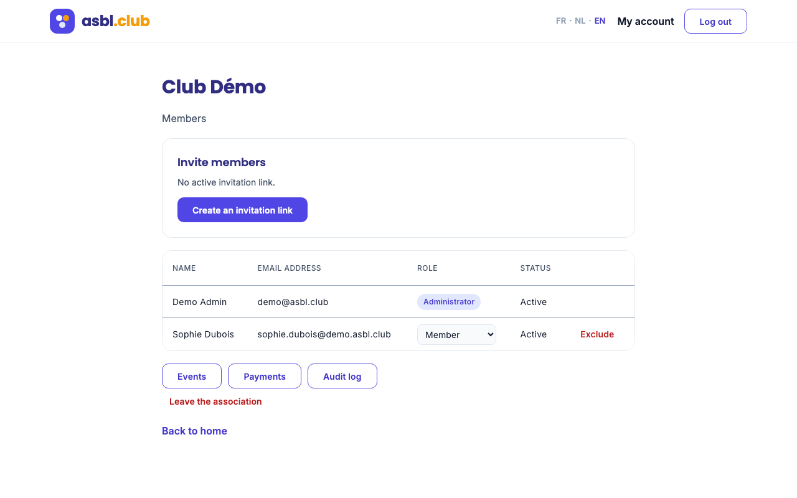
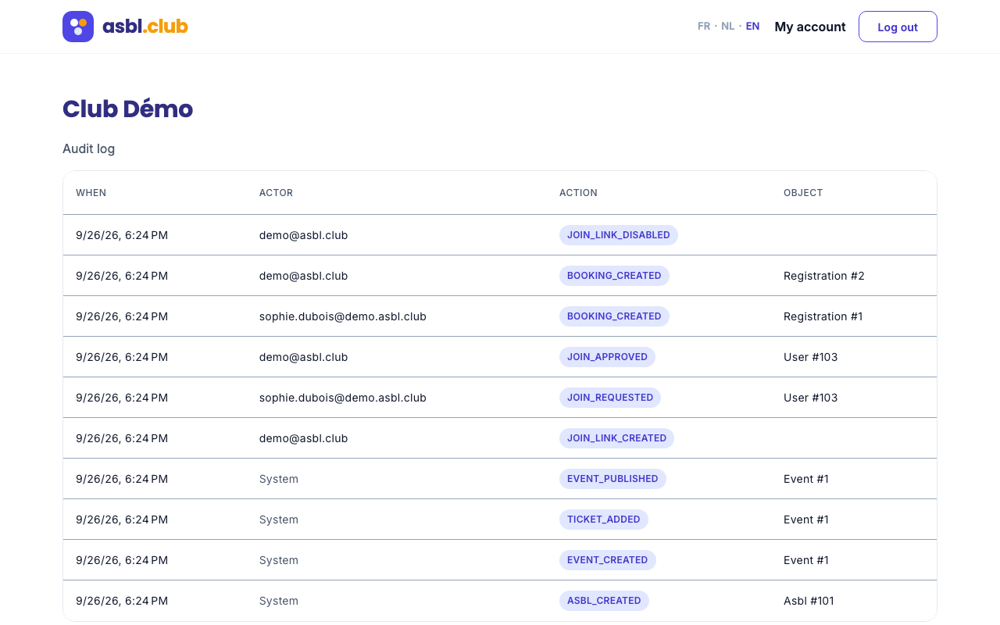
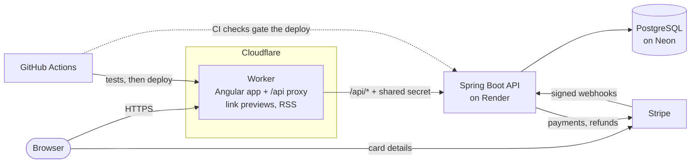

# asbl.club

**A free management platform for Belgian non-profits (ASBL / VZW) and clubs:** members, events, ticketing and
online payments, in French, Dutch and English.

**Live:** https://asbl-club.ynhassan22.workers.dev &nbsp;·&nbsp; [](https://github.com/yassin-hassan/asbl-club/actions/workflows/ci.yml)

Built end to end by one developer as a portfolio project: **Java 21 · Spring Boot 4 · Angular 22 · PostgreSQL ·
Stripe Connect · Cloudflare Workers**, with the same care for security, concurrency and testing a production
system needs. It runs entirely on free tiers.

| Event back office: tickets and attendees | Public event page |
|---|---|
|  |  |
| **Members: invitation link, roles** | **Audit log** |
|  |  |

## What it does

- **Associations and members:** create an association, invite people with a link (an administrator approves
  each request), give roles (administrator, treasurer, member), exclude, leave. An association always keeps at
  least one active administrator.
- **Events and ticketing:** drafts, publishing, editing, cancelling; ticket categories with prices and seat
  limits; a public page with live seat availability, link previews and an RSS feed.
- **Online payments:** members book a seat and pay online through **Stripe Connect**: the money goes
  straight to the association's own Stripe account. Unpaid bookings give their seat back after 30 minutes.
- **Attendee list** for administrators and treasurers, with a CSV export ready for Excel.
- **Audit log** of every sensitive action, readable by the association's administrators.
- **Accounts:** registration, login, personal-data export and account closure (GDPR).

Planned (see the roadmap below): "my bookings" with QR-code tickets and check-in, email (verification, password
reset, confirmations), membership dues and donations.

## Architecture



- **One domain for everything.** A Cloudflare Worker serves the Angular app and forwards `/api/*` to Spring, so
  the browser sees a single origin: no CORS, and the refresh-token cookie stays first-party. The Worker adds a
  shared secret the API requires, so the API only trusts traffic that came through it (the visitor's real IP
  included).
- **The backend is a pure JSON API**, described by OpenAPI. The Angular client is **generated from that
  contract**, and CI fails if the contract changes without the client being regenerated.
- **Card details never touch our servers:** they go from the browser to Stripe. Only Stripe's signed webhook can
  mark a booking paid.
- **Modules react to each other through application events** (an account closed, an event cancelled) instead of
  calling each other.

## Engineering highlights

**Payments that survive the network**
- Stripe delivers webhooks *at least once* and in any order. Each event ID is recorded **in the same
  transaction** as its effect (`INSERT … ON CONFLICT DO NOTHING`), so a repeat, even a simultaneous one, does
  nothing. See [`StripeEventHandler`](backend/src/main/java/club/asbl/asbl_club/payment/StripeEventHandler.java).
- Payment states only move forward, so out-of-order events can't undo a payment. A declined card followed by a
  successful retry ends paid; this bug was found and fixed with a test that replays Stripe's messages.
- Calls to Stripe carry **idempotency keys**; a payment that arrives for a booking cancelled in the meantime is
  **refunded automatically**, safely retried if Stripe is unreachable.

**Concurrency, proven by tests that actually race**
- The last seat can't be sold twice (an atomic conditional `UPDATE`), and "at least one administrator" holds
  when two admins demote each other at the same instant (`SELECT … FOR UPDATE`).
- The booking-expiry job and a payment arriving at the same moment are settled on the booking row. The
  [race test](backend/src/test/java/club/asbl/asbl_club/payment/WebhookIdempotencyTest.java) releases both
  threads together over many rounds; it caught a real bug where Hibernate returned a stale in-memory copy of a
  locked row.

**Security (OWASP Top 10)**
- Deny-by-default authorization, with role and ownership checked on the server for every resource (no
  IDOR by changing an ID in the URL).
- Short-lived RS256 access tokens kept in memory; rotating refresh tokens in an HttpOnly cookie, with **reuse
  detection** that ends a stolen session. Argon2 password hashing. Rate limiting on credential endpoints.
- A strict Content Security Policy with no inline scripts; CSV exports protected against **formula injection**.
- An **append-only audit log enforced by database triggers**: even the application can't rewrite history.
- GDPR: IP addresses hidden from associations, account closure anonymises, personal-data export.

**Testing and delivery**
- **180+ backend tests**: unit tests, and integration tests on a real PostgreSQL via Testcontainers.
- **Frontend unit tests** (Vitest), and **end-to-end tests with Playwright that run through the Cloudflare Worker**,
  as in production.
- Every push runs the pipeline in GitHub Actions; the site deploys only when everything is green, followed by a
  smoke test.

## Tech stack

| | |
|---|---|
| **Backend** | Java 21, Spring Boot 4 (Web MVC, Security, Data JPA, OAuth2 resource server), Hibernate, Flyway, springdoc-openapi |
| **Frontend** | Angular 22 (standalone components, signals, `rxResource`), Angular Material, Transloco (FR/NL/EN), generated OpenAPI client |
| **Data** | PostgreSQL (Neon) |
| **Payments** | Stripe Connect (Express accounts, direct charges, Payment Element) |
| **Edge** | Cloudflare Workers (static assets, API proxy, HTMLRewriter link previews) |
| **Tests** | JUnit 5, Mockito, Testcontainers, MockMvc, Vitest, Playwright |
| **CI/CD** | GitHub Actions, Wrangler, Render (Docker), Dependabot |

## Repository layout

```
backend/    Spring Boot API: one package per module (auth, membership, event, payment, audit, …)
frontend/   Angular app, the Cloudflare Worker (worker/), end-to-end tests (e2e/), the OpenAPI contract (openapi/)
compose.yaml   PostgreSQL (and the Stripe CLI) for local development
```

## Running it locally

Requirements: Java 21, Node 22, Docker.

```bash
# 1. PostgreSQL (from the repository root)
docker compose up -d postgres

# 2. The API on :8080, with demo data
cd backend
SPRING_DOCKER_COMPOSE_ENABLED=false \
SPRING_DATASOURCE_URL=jdbc:postgresql://localhost:5432/mydatabase \
SPRING_DATASOURCE_USERNAME=myuser SPRING_DATASOURCE_PASSWORD=secret \
./mvnw spring-boot:run -Dspring-boot.run.profiles=demo

# 3. The Angular app on :4200 (it proxies /api to :8080)
cd frontend
npm install --legacy-peer-deps
npm start
```

Open http://localhost:4200 and log in as `demo@asbl.club` / `password123` (the demo profile creates it, with an
association and a published event). Paying needs Stripe test keys (`STRIPE_SECRET_KEY`, `STRIPE_PUBLISHABLE_KEY`,
`STRIPE_WEBHOOK_SECRET`) and the Stripe CLI from `compose.yaml` to forward webhooks; everything else works
without them.

```bash
cd backend && ./mvnw test      # backend tests (Testcontainers starts its own PostgreSQL through Docker)
cd frontend && npm test        # frontend unit tests
cd frontend && npm run e2e     # end-to-end tests, with the API from step 2 running (starts the app itself)
```

## Roadmap

Done: associations and members, events and ticketing, Stripe payments with idempotent webhooks, booking expiry,
attendee list, audit log, edge deployment. Next: QR-code tickets and check-in, email (verification, password
reset, confirmations), membership dues and donations with Belgian tax receipts, error tracking and structured
logs, infrastructure as code (Terraform).
